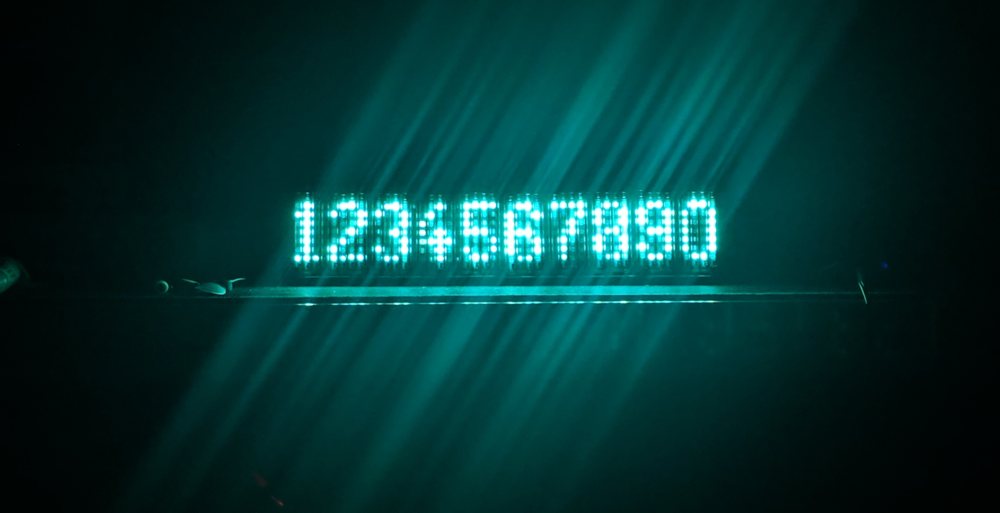
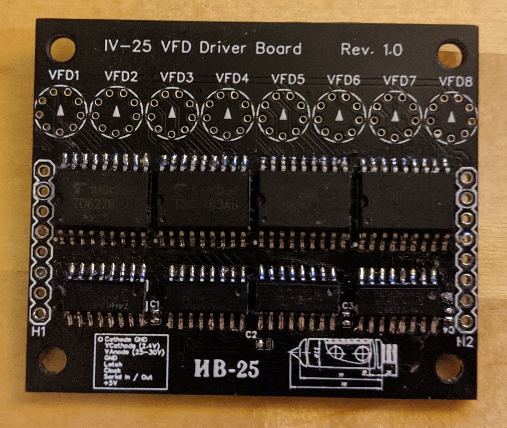
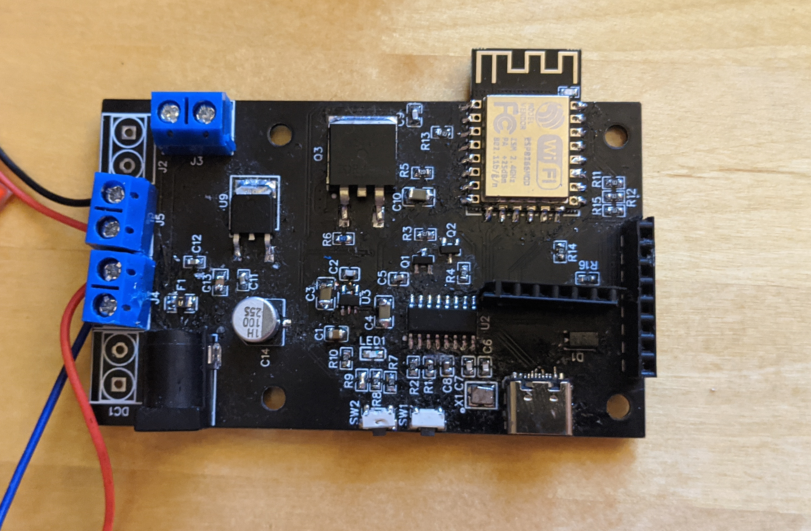
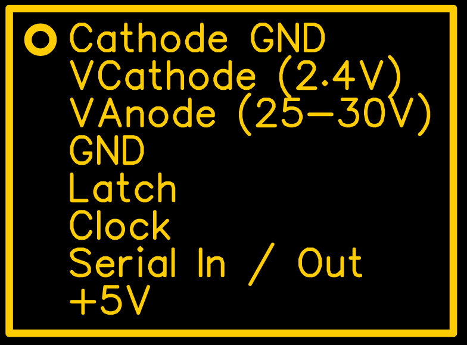

# IV-25-VFD-Display


IV-25 Display modules that support daisy chaining. Comes with its own ESP8266 Controller Board

Basically the Project consists of two parts. The Display Modules and a Controller board, that controls one or more Display Modules

## Display Module

The Display Module consists of 8 74HC595 shift registers connected in series. The serial output of the last register can be connected to the input of antoter module to connect multiple modules in series. This can be done by connecting the headers H1 from one board to H2 from another board.
The headers also break out the clock and latch pins as well as the power supply for the 5V-logic, the anonde and the cathode.

Each shift register drives a TD62783 high voltage source driver, which in turn drives the actual tube.
Since each tube has seven dots and each shift-register / source driver has 8 channels, the first output of each shift register / source driver isn't used. Also the assignment between the outputs of the source driver and the anodes vary depending on whether the driver chips are on the top or bottom of the board. Be aware of that if you write your own library for the module. Also be aware that the footprint that I found for the IV-25 has the silkscreen print on the bottom. So the circle and the arrow need to be visible after soldering in the tube.

## Controller Module
*Important: The Controller Module is currently being tested and its full functionality has not been verified yet. Proceed with caution!*



Currently Working:
* 5V and 3,3V Rails
* USB-UART
* Communication with Display Modules
* MOSFET for switching cathode voltage

Untested:
* Buttons

The Controller Board is basically a NodeMCU-Board with USB-C and some other features needed for interfacing with the Display Modules.

### Power Supply
It has a 12V power jack and screw terminal  protected by a fuse for supplying power to it. There is a 5V and a 3,3V regulator on the board that supplies the ESP8266 and the Logic of the display modules. For supplying power for the cathodes (2.4V) and anodes (25-30V) of the display modules, screw terminals can be used to connect step-up / step-down modules. This method was chosen over onboard step-up / step-down converters to be able to easily change the specs of the dc/dc converters as the power requirements can vary quite a bit depending on the number of connected display modules.

After some testing it seems like revision 1.0 of the PCB can handle about 6 modules before the current of the cathode gets too high. I'll try to increase the trace width and switch the cathode connector from a 2,54mm header to a screw terminal for the next revision to support up to 9 modules.

### Display Module Interface

The Display Modules can be attached via the 2.4mm Pinheader on the edge of the board.
Its pinout can be seen in the following picture:



It is identical to the pinout on the actual display modules so they can be connectd by simply using jumper cables.

### USB-UART
The USB-UART connection is just a standard CH340 implementation like it can be found in the cheap Arduino Nano clones and some NodeMCU modules.

### Switched Cathode
I included a IRLZ44 MOSFET for switching the low side of the cathode in order to turn the entire display on and off. It is connected to GPIO12 12 of the ESP8266

### I2C Expansion Header
Since I am planning on using the display over longer periods of time, I want it to be able to turn itself on, once someone steps in front of it and turn off after some time when no one is looking at it to save power. I dont't want a big, ugly PIR-Sensor to do the motion detection and will try experimenting with a VL6180 i2c laser distance sensor. For interfacing it, an additional Pinheader is located between the ESP8266 module and the USB-C socket.

Pinout:

| 1   | 2   |         3         | 4   | 5   | 6   |
|-----|-----|-------------------|-----|-----|-----|
| +5V | IO9 | 47k Pullup to +5V | SCL | SDA | GND |

## The Library
font.h specifies an array for the actual font data and a second array that stores the offsets of each ASCII character inside the first array. In the font data array 0b11111111 is used to mark the end of a character, compareable to the "\0" at the end of a string. The constructor `IV25Display(uint16_t len, uint8_t latch, uint8_t data, uint8_t clock);` can be used to create a new display object and the method   `void print(char * str);` can be called to print an arbitrary string on the display. If you prefer setting individual bits of the display, you can pass a char array containing the raw data to be displayed to `void raw(char * str, uint16_t buf_len);`. Each byte corresponds to one IV-25 tube.

You can find sketches of a simple Hello World and for writing raw bytes to the display in the examples of the Library.

``` C++
#include "display.h"

int latchPin = 13; //Pin connected to ST_CP of 74HC595
int clockPin = 16; //Pin connected to SH_CP of 74HC595
int dataPin = 14; //Pin connected to DS of 74HC595
int enablePin = 12; // Pin connected to the Cathode MOSFET

IV25Display dsp( 6 * 8, latchPin, dataPin, clockPin, enablePin);

void setup() {
  dsp.print("Hello World!");

}

void loop() {
    delay(1000);
}
```
