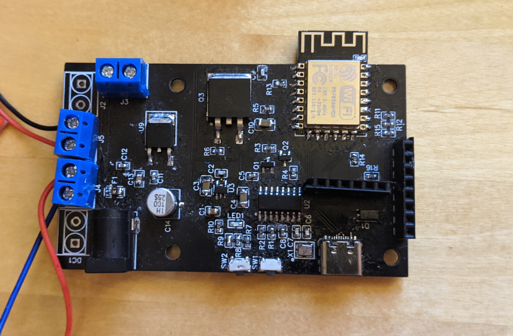

# IV-25-VFD-Display PCB files

In this folder you will find PDFs of the schematics and Gerber files for the boards. I created these in the EasyEDA Tool.
If you want to fork the design, use the following links:

## Display Module

* [BOM, Schematic and PCB files](https://oshwlab.com/fan4tix/IV-25-Dispaly)

This PCB drives 8 tubes each. Each tube gets its own 74HC595 shift register, that sets the outputs of a TD62783 high voltage source driver, which in turn drives the actual tube. Each dot of each tube can be adressed by shifting in its value into the shift register. That way, multiple modules can be daisychained after another.

## Controller Board

* [BOM, Schematic and PCB files](https://oshwlab.com/fan4tix/iv-25-controller)

The Controller Board for the IV-25 [Display Module](https://oshwlab.com/fan4tix/IV-25-Dispaly). It is basically a USB-C NodeMCU Board with onboard 5V and 3,3V regulator, a MOSFET for switching the Cathode on and off and extension ports for the Anode / Cathode Step-Up/Downs and the actual display modules. I also added an expansion header that allows for i2c devices to be connected to the controller. I am planning on using a laser distance sensor as a "movement detector" to activate the display only when someone is standing in front of it.

After some testing it seems like revision 1.0 of the PCB can handle about 6 modules before the current of the cathode gets too high. I'll try to increase the trace width and switch the cathode connector from a 2,54mm header to a screw terminal for the next revision to support up to 9 modules.
